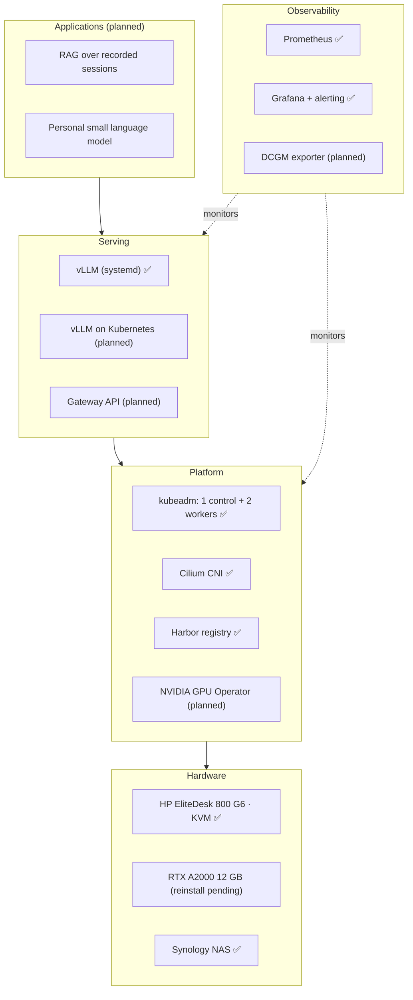

# Home LLM Inference Platform

Running large language models on Kubernetes, from the GPU up to the application.

📊 [Portfolio slides (PDF)](docs/portfolio.pdf)

> **Status:** Work in progress. The Kubernetes platform is running; GPU integration and LLM serving on Kubernetes are the next milestones. See [Status](#status).

---

## Why this project

I have 28 years of experience in infrastructure, L3 technical support, professional services and project management, but no LLM job title yet. This project is my evidence that I can:

- **Cover both layers**: understand how LLMs work, and operate the GPU platform underneath them
- **Measure, not just build**: back design choices with monitoring data and reproducible benchmarks
- **Troubleshoot like a support engineer**: every incident is written up with symptom, root cause and fix

## Architecture



## Status

| Component | Status | Notes |
|---|---|---|
| kubeadm cluster | ✅ Running | 1 control plane + 2 workers on KVM VMs |
| Cilium CNI | ✅ Running | Enforces standard NetworkPolicy |
| Harbor registry | ✅ Running | Self-hosted image source for the cluster |
| vLLM (Phi-3-mini-4k-instruct) | ✅ Running | systemd service; OpenAI-compatible API tested from a remote client |
| Prometheus + Grafana | ✅ Running | Host metrics and custom memory alerting |
| GPU worker + GPU Operator | 🔜 Next | Waiting on the GPU power fix |
| vLLM on Kubernetes | 📋 Planned | Deployment, Harbor images, Gateway API |
| GPU and LLM dashboards | 📋 Planned | DCGM exporter and vLLM metrics |

## Roadmap

- [ ] **Phase 1: GPU in the cluster** — Reinstall the RTX A2000, pass it through to a worker VM, deploy the NVIDIA GPU Operator
- [ ] **Phase 2: LLM serving on Kubernetes** — Move vLLM to a Deployment, pull images from Harbor, expose it through Gateway API
- [ ] **Phase 3: Observability** — DCGM exporter for GPU health, vLLM metrics for latency and throughput, Grafana dashboards
- [ ] **Phase 4: Benchmarks** — Compare quantization, concurrency and context length on a 12 GB GPU
- [ ] **Phase 5: Applications** — RAG over recorded sessions and a personal small language model on top of the platform

## Benchmarks

Questions the benchmarks will answer. Results will be published here with their method, so anyone can reproduce them.

| Question | Variable | Metrics | Result |
|---|---|---|---|
| How many concurrent users fit on 12 GB? | Concurrent requests | Tokens/s, p95 latency | TBD |
| What does quantization trade away? | FP16 vs 4-bit | Tokens/s, VRAM, quality | TBD |
| How long can the context get? | Max model length | VRAM, time to first token | TBD |
| Which model size fits best? | Small vs mid-size models | Tokens/s, VRAM | TBD |

## Troubleshooting log

Real incidents from building this lab, written the way I wrote L3 support cases.

| Symptom | Root cause | Fix | Status |
|---|---|---|---|
| Long-running scripts killed when the remote desktop disconnected | systemd ended the user session (`Linger=no`) | `loginctl enable-linger` | ✅ Fixed |
| Hardware video acceleration not working on a Haswell machine | Wrong VA-API driver for that GPU generation | Use the `i965` driver instead of `iHD` | ✅ Fixed |
| Power error on the host after adding the GPU | Suspected: stock 260 W power supply | GPU removed safely; fix in progress | 🔧 Open |

## Repository structure

```
.
├── README.md
├── docs/
│   └── portfolio.pdf        # Portfolio slides
├── cluster/                 # kubeadm, Cilium and Harbor setup notes and manifests
├── serving/                 # vLLM deployment manifests
├── observability/           # Prometheus, Grafana dashboards, alert rules
└── benchmarks/              # Benchmark scripts and results
```

> Folders other than `docs/` will be added as each phase is completed.

## Skills demonstrated

| Skill | Evidence |
|---|---|
| Kubernetes administration | kubeadm cluster with Cilium and Harbor; CNCF KCNA |
| GPU infrastructure | GPU passthrough on KVM, CUDA; NVIDIA NCA-AIIO |
| LLM serving | vLLM as a managed service with an OpenAI-compatible API |
| Observability | Prometheus, Grafana and custom alerting in daily use |
| Troubleshooting | L3 support background; documented troubleshooting log |

## About

**Hito** — Bilingual (Japanese / English) engineer based in Japan, with a background in L3 technical support, professional services and program management for semiconductor process optimization software.

- GitHub: [@htatemura](https://github.com/htatemura)
- Blog: [blog URL]
- LinkedIn: [LinkedIn URL]
