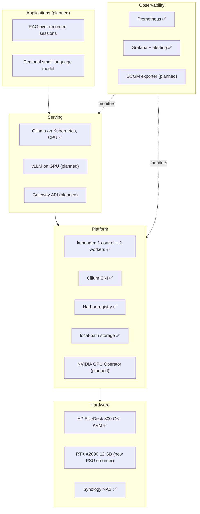

# Home LLM Inference Platform

Running large language models on Kubernetes, from the GPU up to the application.

📊 [Portfolio slides (PDF)](docs/portfolio.pdf) · 📘 [Runbook](docs/runbook.md)

> **Status:** Phase 1 complete. An LLM is served on Kubernetes (CPU) through an OpenAI-compatible API. GPU integration is next, waiting on a replacement power supply. See [Status](#status).

---

## Why this project

I have 28 years of experience in infrastructure, L3 technical support, professional services and project management, but no LLM job title yet. This project is my evidence that I can:

- **Cover both layers**: understand how LLMs work, and operate the GPU platform underneath them
- **Measure, not just build**: back design choices with monitoring data and reproducible benchmarks
- **Troubleshoot like a support engineer**: every incident is written up with symptom, root cause and fix

## Architecture



## Status

| Component | Status | Notes |
|---|---|---|
| kubeadm cluster | ✅ Running | 1 control plane + 2 workers on KVM VMs |
| Cilium CNI | ✅ Running | Enforces standard NetworkPolicy |
| Harbor registry | ✅ Running | Self-hosted image source for the cluster |
| LLM serving on Kubernetes (CPU) | ✅ Running | Ollama 0.34.4 + Llama 3.2 3B on a dedicated LLM node (`workload=llm`), image from Harbor |
| Model storage | ✅ Running | local-path-provisioner; models persist across Pod restarts |
| Prometheus + Grafana | ✅ Running | Host metrics and custom memory alerting |
| GPU worker + GPU Operator | 🔜 Next | Replacement power supply on order |
| vLLM on GPU | 📋 Planned | Same OpenAI-compatible API, swapped in on GPU |
| Gateway API | 📋 Planned | External access through Cilium |
| GPU and LLM dashboards | 📋 Planned | DCGM exporter and vLLM metrics |

## Roadmap

- [x] **Phase 1: LLM serving on Kubernetes (CPU)** — Ollama from Harbor, persistent model storage, OpenAI-compatible API verified ([manifests](serving/ollama/))
- [ ] **Phase 2: GPU in the cluster** — New power supply, RTX A2000 to the LLM node, NVIDIA GPU Operator, vLLM on GPU, Gateway API
- [ ] **Phase 3: Observability** — DCGM exporter for GPU health, vLLM metrics for latency and throughput, Grafana dashboards
- [ ] **Phase 4: Benchmarks** — Compare quantization, concurrency and context length on a 12 GB GPU
- [ ] **Phase 5: Applications** — RAG over recorded sessions and a personal small language model on top of the platform

## Benchmarks

Questions the benchmarks will answer. Results will be published here with their method, so anyone can reproduce them.

| Question | Variable | Metrics | Result |
|---|---|---|---|
| How many concurrent users fit on 12 GB? | Concurrent requests | Tokens/s, p95 latency | TBD |
| What does quantization trade away? | FP16 vs 4-bit | Tokens/s, VRAM, quality | TBD |
| How long can the context get? | Max model length | VRAM, time to first token | TBD |
| Which model size fits best? | Small vs mid-size models | Tokens/s, VRAM | TBD |

## Troubleshooting log

Real incidents from building this lab, written the way I wrote L3 support cases.

| Symptom | Root cause | Fix | Status |
|---|---|---|---|
| Long-running scripts killed when the remote desktop disconnected | systemd ended the user session (`Linger=no`) | `loginctl enable-linger` | ✅ Fixed |
| Hardware video acceleration not working on a Haswell machine | Wrong VA-API driver for that GPU generation | Use the `i965` driver instead of `iHD` | ✅ Fixed |
| Power error on the host after adding the GPU | Suspected: stock 260 W power supply | GPU removed safely; fix in progress | 🔧 Open |

## Repository structure

```
.
├── README.md
├── docs/
│   ├── portfolio.pdf        # Portfolio slides
│   └── runbook.md           # Operational procedures
├── serving/
│   └── ollama/              # Ollama on Kubernetes (Phase 1)
├── cluster/                 # kubeadm, Cilium and Harbor setup notes and manifests
├── observability/           # Prometheus, Grafana dashboards, alert rules
└── benchmarks/              # Benchmark scripts and results
```

> Other folders will be added as each phase is completed.

## Skills demonstrated

| Skill | Evidence |
|---|---|
| Kubernetes administration | kubeadm cluster with Cilium and Harbor; CNCF KCNA |
| GPU infrastructure | GPU passthrough on KVM, CUDA; NVIDIA NCA-AIIO |
| LLM serving | Ollama on Kubernetes with an OpenAI-compatible API |
| Observability | Prometheus, Grafana and custom alerting in daily use |
| Troubleshooting | L3 support background; documented troubleshooting log |

## About

**Toshi** — Bilingual (Japanese / English) engineer based in Japan, with a background in L3 technical support, professional services and program management for semiconductor process optimization software.

- GitHub: [@htatemura](https://github.com/htatemura)
- Blog: [blog URL]
- LinkedIn: [LinkedIn URL]
